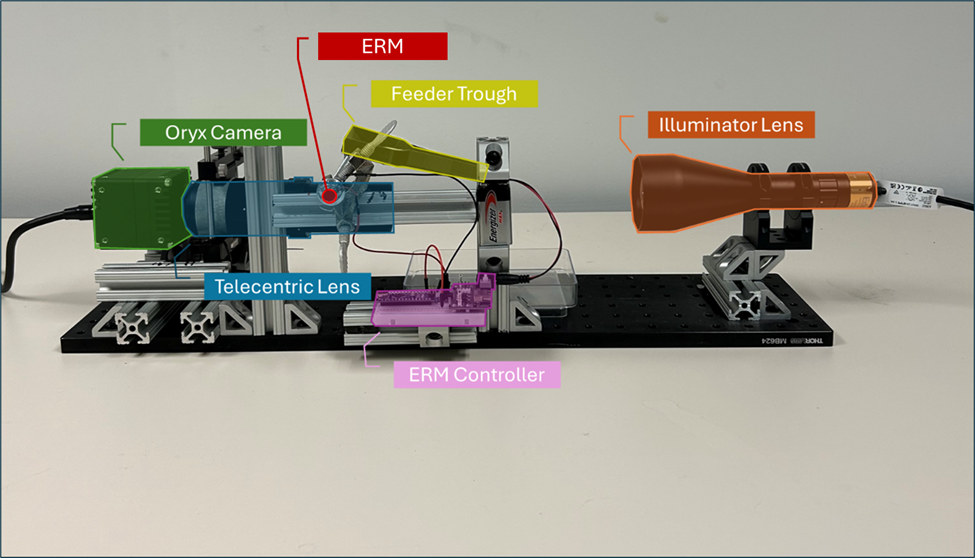

# 2D DIA Prototype System

## Component overlays




# Grain Size Analysis Pipeline

This repository contains scripts and workflows for analyzing sand grain size distributions using image-based methods and comparing results to ground truth sieve data. The code supports data aggregation, outlier removal, grain size distribution (GSD) curve computation, and ground truth comparison, with support for both real and synthetic data.

## Table of Contents

- [Overview](#overview)
- [Directory Structure](#directory-structure)
- [Scripts](#scripts)
- [SLURM Job Submission](#slurm-job-submission)
- [Example Usage](#example-usage)
- [Citation](#citation)
- [Contact](#contact)

---

## Overview

This pipeline enables:

- Calculation of ground truth sieve results from laboratory data.
- Aggregation and analysis of grain size distributions from large image datasets.
- Comparison of image-based results to standard sieve curves.
- Analysis of synthetic and amodal segmentation data.
- Scalable processing via SLURM job scripts for high-throughput experiments.

## Scripts

The repository includes the following main scripts and modules:

- `analyze_amodal_grain_capture.py`: Aggregates and analyzes grain size distributions from amodal segmentation predictions.
- `analyze_threshold_grain_capture.py`: Processes and analyzes grain size distributions using threshold-based segmentation.
- `process_threshold_grain_capture.py`: Alternative threshold-based analysis pipeline.
- `analyze_synth_grain.py`: Analyzes synthetic data using COCO-format JSON annotations.
- `utils/load_json.py`: Utility functions for loading COCO-format JSON annotation files.
- `plotting_functions.py`: Functions for computing grain size distributions, percent passing, and plotting GSD curves.
- `sieve_ground_truth.py`: Script for interpolating and saving ground truth sieve results for each sand sample.
- `counter.py`: Gets the number of individual grains observed, and the number of frames captured. 
- `combine_multiple_captures.py`: Combines multiple data collections to get the aggregated GSD and other characteristics.  

See the individual script docstrings for details on arguments and workflow.

---

## SLURM Job Submission
To submit a batch of jobs, use the provided bash script templates and adjust paths, experiment names, and model types as needed. For example:

```bash
sbatch run_amodal_analysis.sh
sbatch run_ostu_analysis.sh
sbatch run_synth_analysis.sh
```

Or, for batch submission via a loop:

```bash
sbatch batch_amodal_analysis.sh
```

**Note:** Make sure to activate the correct Python environment and update paths to your data and models.

---

## Example Usage

### 1. Aggregate and Analyze Amodal Segmentation Results

```bash
python3 -m analyze_amodal_grain_capture \
    --save_dir /path/to/save/ \
    --pred_dir /path/to/predictions/ \
    --pixel2mm 0.00493177 \
    --sand_name Triton \
    --exp Triton_amodal_144fps
```

### 2. Analyze Threshold Segmentation Results

```bash
python3 -m analyze_threshold_grain_capture \
    --img_dir /path/to/images/ \
    --save_dir /path/to/save/ \
    --pixel2mm 0.00493177 \
    --sand_name Venice_Beach \
    --exp Venice_all_36fps
```

### 3. Analyze Synthetic Data

```bash
python3 -m analyze_synth_grain \
    --save_dir /path/to/save/ \
    --coco_json /path/to/particle_test_B_500.json \
    --pixel2mm 0.00493177
```

### 4. Compute Ground Truth Sieve Results

```python
from sieve_ground_truth import get_results

result_df, _ = get_results("Venice_Beach")
result_df.to_csv("/projects/OLIVINE/data/sieve_results/Venice_Beach.csv", index=False)
```

---

## Citation

If you use this pipeline or code in your research, please cite:

```
TBD
```

---

## Contact

For questions, bug reports, or feature requests, please contact:

- **Lead Developer:** [Eric Bianchi] (ebianchi@mitre.org)
- **Organization:** The MITRE Corporation

Or open an issue on [GitHub](https://github.com/your-repo/grain-size-analysis/issues).

---

**Copyright 2025 The MITRE Corporation**

---

